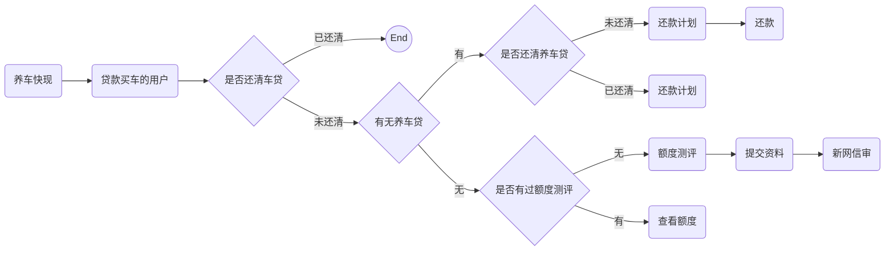

## markdown 语法

  - [标题](#%标题)
  - [段落](#段落)
  - [列表](#列表)
  - [行](#行)
  - [链接](#链接)
  - [代码块](#代码块)
  - [文字](#文字)
  - [表格](#表格)
  - [图片](#图片)
  - [引用](#引用)
  - [符号](#符号)
  - [流程图](#流程图)


---------

### 标题


*示例*

```
  # 一级标题
  ## 二级标题
  ### 三级标题
  #### 四级标题
  ##### 五级标题
  ###### 六级标题
``` 

*效果*
 >  # 一级标题
 >  ## 二级标题
 >  ### 三级标题
 >  #### 四级标题
 >  ##### 五级标题
 >  ###### 六级标题
 

[返回目录](#markdown 语法) 

---------
 
### 段落

段落结束后须空一行

*示例一*

```
这是第一行

这是第二行

```

*效果*

这是第一行

这是第二行


*示例二*

```
这是第一行
这是第二行

```

*效果*

这是第一行
这是第二行

-----

### 列表

#### 有序列表

*示例*

```
1. 第一条
1. 第二条
1. 第三条
1. 第四条
```

1. 第一条
1. 第二条
1. 第三条
1. 第四条


#### 无序列表

*示例1*

```
- 第一条
- 第二条
- 第三条
- 第四条
```
- 第一条
- 第二条
- 第三条
- 第四条


*示例2*

```
+ 第一条
+ 第二条
+ 第三条
+ 第四条
```

+ 第一条
+ 第二条
+ 第三条
+ 第四条


*示例3*

```
* 第一条
* 第二条
* 第三条
* 第四条
```

* 第一条
* 第二条
* 第三条
* 第四条

#### 多级列表

*示例*

```
- 1. 第一章
  - 1.1 第一节
    - 1.1.1 第一课
    - 1.1.2 第二课
  - 2.1 第二节
  - 2.2 第三节
- 2. 第二章
- 3. 附录
    - 名词解释
    - 参考文献
```


- 1. 第一章
  - 1.1 第一节
    - 1.1.1 第一课
    - 1.1.2 第二课
  - 2.1 第二节
  - 2.2 第三节
- 2. 第二章
- 3. 附录
    - 名词解释
    - 参考文献


[返回目录](#markdown 语法)

-----


### 行

 行内 标记 <code> ` `</code>
 
 ```
 我是一个`行内标记`,效果还不错吧
 ```
 
  我是一个`行内标记`,效果还不错吧
  
  [返回目录](#markdown 语法)

-----


### 链接

#### 外部链接

*示例*

```
[开发规范](https://www.baidu.com)
```

[开发规范](https://www.baidu.com)

#### 锚记

*示例*

```
[点我到定位到无序列表](#无序列表)
```
[点我到定位到无序列表](#无序列表)


#### 邮箱

*示例*

```
<alvinor@qq.com>
```
<alvinor@qq.com>

[返回目录](#markdown 语法)

------

#### 代码块

代码块使用一对 \`\`\`  或者 \<code\> 实现 

*示例*
<pre>
```php
    $a = 1;
    phpinfo();
    class A {
        CONST UX=1
    
        public function abc(){
            return "abc"
        }
    }
```
</pre>

```php
    $a = 1;
    phpinfo();
    class A {
        CONST UX=1
    
        public function abc(){
            return "abc"
        }
    }
```


[返回目录](#markdown 语法)

------


### 文字

示例

```
**加粗**

*斜体*

_斜体_

***粗斜体***

~~删除线~~

~下划线~

_下划线_

上标 x<sup>2</sup>

下标 α<sub>1</sub>


```


**加粗**

*斜体*

_斜体_

***粗斜体***

~~删除线~~

~下划线~

_下划线_

上标 x<sup>2</sup>

下标 α<sub>1</sub>

[返回目录](#markdown 语法)

-----

### 表格

*示例*

```
1|2|3
-:|:-:|:-
**左对齐**|**居中**|**右对齐**
`--:`|`:---`|`:---`
========撑宽看效果=========|========撑宽看效果=========|========撑宽看效果=========
```


1|2|3
-:|:-:|:-
**左对齐**|**居中**|**右对齐**
`--:`|`:---`|`:---`
========撑宽看效果=========|========撑宽看效果=========|========撑宽看效果=========


[返回目录](#markdown 语法)

------


### 图片

*示例*

```

[](https://travis-ci.org/laravel/lumen-framework)

[](https://packagist.org/packages/laravel/lumen-framework)

[](https://packagist.org/packages/laravel/lumen-framework)
[](https://packagist.org/packages/laravel/lumen-framework)
[](https://packagist.org/packages/laravel/lumen-framework)

```

[](https://travis-ci.org/laravel/lumen-framework)

[](https://packagist.org/packages/laravel/lumen-framework)

[](https://packagist.org/packages/laravel/lumen-framework)
[](https://packagist.org/packages/laravel/lumen-framework)
[](https://packagist.org/packages/laravel/lumen-framework)


[返回目录](#markdown 语法)

-----

### 引用

```
> 一级引用
>> 二级引用
>>> 三级引用

>> 又是二级
>>> 又是三级
>>>> 不好意思又来了个四级

>>> 还是三级慢慢玩

> 直接回到一级吧
>> 我是二级，我要说话
>> 我是二级，拜拜

```

> 一级引用
>> 二级引用
>>> 三级引用

>> 又是二级
>>> 又是三级
>>>> 不好意思又来了个四级

>>> 还是三级慢慢玩

> 直接回到一级吧
>> 我是二级，我要说话
>> 我是二级，拜拜

[返回目录](#markdown 语法)

--------

### 符号

语法|效果
:-:|:-:
`:sun_with_face:`|:sun_with_face:
`:laughing:`|:laughing:
`:smiley:`|:smiley:
`:smirk:`|:smirk:
`:kissing_heart:`|:kissing_heart:
`:flushed:`|:flushed:
`:satisfied:`|:satisfied:
`:wink:`|:wink:
`:stuck_out_tongue_closed_eyes:`|:stuck_out_tongue_closed_eyes:
`:kissing:`|:kissing:
`:stuck_out_tongue:`|:stuck_out_tongue:
`:worried:`|:worried:
`:anguished:`|:anguished:
`:confused:`|:confused:
`:expressionless:`|:expressionless:
`:sweat_smile:`|:sweat_smile:
`:smile:`|:smile:
`:blush:`|:blush:
`:relaxed:`|:relaxed:
`:heart_eyes:`|:heart_eyes:
`:kissing_closed_eyes:`|:kissing_closed_eyes:
`:relieved:`|:relieved:
`:grin:`|:grin:
`:stuck_out_tongue_winking_eye:`|:stuck_out_tongue_winking_eye:
`:grinning:`|:grinning:
`:kissing_smiling_eyes:`|:kissing_smiling_eyes:
`:sleeping:`|:sleeping:
`:frowning:`|:frowning:
`:open_mouth:`|:open_mouth:
`:hushed:`|:hushed:
`:unamused:`|:unamused:
`:sweat:`|:sweat:


[返回目录](#markdown 语法)


-----

### 流程图

_非通用_ gitlab 采用 mermaid 扩展

*示例*


> \`\`\`mermaid
>
>  graph LR
>    
>    A(养车快现)-->B(贷款买车的用户);
>    
>    B --> C{是否还清车贷};
>    
>    C --> | 已还清 | End((End));
>   
>    C --> | 未还清|D{有无养车贷};
>    
>    D-->|无|E{是否有过额度测评};
>    
>    D-->|有|F{是否还清养车贷};
>    
>    F-->|未还清|G(还款计划);
>    
>    F-->|已还清|H(还款计划);
>    
>    E-->|无|I(额度测评);
>    
>    E-->|有|J(查看额度);
>   
>    G-->K(还款);
>    
>    I-->L(提交资料);
>    
>    L-->M(新网信审);
> \`\`\`



